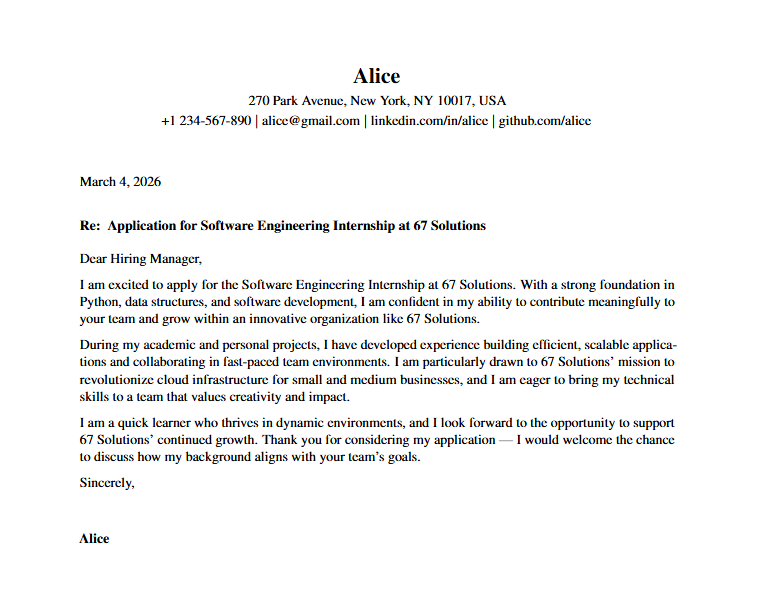

# Cover Letter Automation
CLI tool using python that auto-generates tailored cover letters using Claude AI and injects the output directly into a LaTeX template. 

### How it works:

- Parses your resume from a PDF file
- Scrapes the job posting from the provided URL using Selenium
- Sends both to the Claude API, which returns a tailored subject, salutation, and body as JSON
- Locates the corresponding sections in your LaTeX cover letter template using regex markers
- Replaces each section with the generated content

##### Approximate Cost: $0.06-0.1 / run

---

## Usage

*Optional:* Download the template Cover Letter LaTeX file.

```bash
$ python3 main.py <job posting url>
```
Will only work if the resume format is **PDF**

```bash
$ python3 main.py --usefile
```
Difference is, **--usefile** argument means you are using a file in your local directory as the job posting. Redundancy in case websites are locked or requires login.

**Claude Model:** claude-sonnet-5

#### Example Output



---

## Variables
#### functions.py
```py
TEX_FILE = "COVER LETTER TEX FILE LOCATION"
```

#### ai.py 
```py
RESUME_FILE = "RESUME FILE LOCATION"
JOB_POSTING_FILE = "LOCAL FILE FOR JOB POSTING (for --usefile argument)"
```

#### Environment Variables
```
ANTHROPIC_API_KEY=
```

---

## Docs
If you want to change the regex markers, you can go to the functions.py file and change it in each function: 

For example in the ```replace_body``` function: 
```python
pattern = r'(% -- BODY BEGIN --\n).*?(% -- BODY END --)'
```
The markers are ```% -- BODY BEGIN --``` and ```% -- BODY END --```, this basically means, it pulls the text inside the markers. You can change the markers in each function to your own liking.